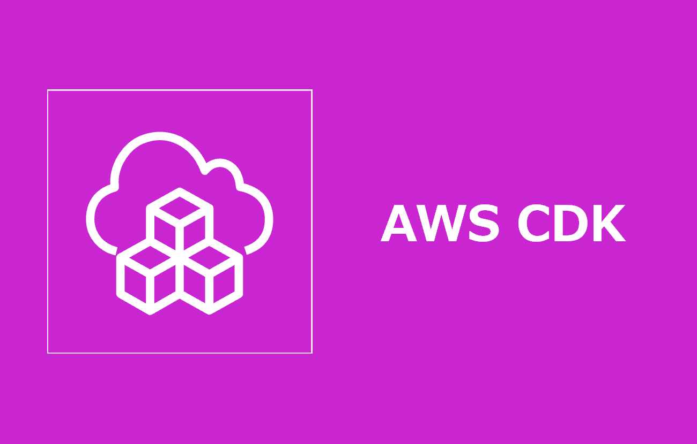

===============================================================================
AWS CDK v2で擬似パラメータを使用する方法 in TypeScript
===============================================================================

* `こちらの記事 <>`_ の環境デプロイ用コードを格納しています

フォルダ構成
=====================================================================
* `こちら <./folder.md>`_ を参照

前提条件
=====================================================================
* *AdministratorAccess* がアタッチされているIAMユーザーのアクセスキーID/シークレットアクセスキーを作成していること
* 実作業は *cdk-app* フォルダ配下で実施すること
* 以下コマンドを実行し、*admin* プロファイルを作成していること (デフォルトリージョンは *ap-northeast-1* )

.. code-block:: bash

  aws configure --profile admin

事前作業(1)
=====================================================================
1. 各種モジュールインストール
---------------------------------------------------------------------
* `GitHub <https://github.com/tyskJ/common-environment-setup>`_ を参照

事前作業(2)
=====================================================================
1. 依存関係のインストール
---------------------------------------------------------------------
.. code-block:: bash

  npm install

2. CDKデプロイメント事前準備
---------------------------------------------------------------------
.. code-block:: bash

  cdk bootstrap --profile admin

実作業 - ローカル -
=====================================================================
1. デプロイ
---------------------------------------------------------------------
.. code-block:: bash

  cdk deploy --profile admin

後片付け - ローカル -
=====================================================================
1. 環境削除
---------------------------------------------------------------------
.. code-block:: bash

  cdk destroy --profile admin
